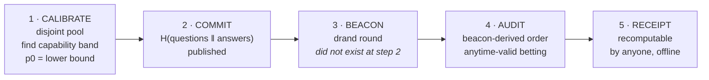

# Heartwood

**A publicly verifiable proof that an LLM endpoint actually spent the compute you paid for — requiring zero cooperation from the provider.**

<br clear="left">

[](LICENSE)
[](SPEC.md)
[](https://zcashsensei.github.io/heartwood/)

Every **verification** path is checkable from a clean clone with a stock
Python — **no third-party dependencies, no network access**: the test suite
(121 tests), an
independent re-derivation of all 5,400 ground truths, the cross-language test
vectors, every published receipt across all three protocol versions, the
adversary suite, and a check that each figure quoted in the preprint matches the
receipt it came from.

```bash
python tests.py && python verify_truth.py && python paper/check_paper.py
```

> Hollow-LLM shows the trunk can be empty. Heartwood proves it is solid.

---

| | |
|---|---|
| **What to read first** | this page, then [SPEC.md](SPEC.md) |
| **Why another layer** | [THREAT_MODEL.md](THREAT_MODEL.md) |
| **The numbers** | [RESULTS.md](RESULTS.md) |
| **The 62 sources** | [SOURCES.md](SOURCES.md) |
| **Verify a receipt** | `python verify.py evidence/receipt_hollow.json` |

## The one-paragraph version

Every existing way to verify a hosted LLM binds the wrong object. TEE
attestation binds the *box*. zkML binds the *equations*. AEX and zkTLS bind the
*signature chain*. None of them binds **computational effort per request** —
and in July 2026 the [Hollow-LLM attack](https://arxiv.org/abs/2607.28884)
proved cryptography cannot: *"proof of correct inference is not proof of
large-model execution."* Behavioural audits can measure effort, but
[IRIS](https://arxiv.org/html/2607.20860) — the state of the art — states its
own limitation: *"no mechanism allows independent verification; the audit is
auditor-centric."* Heartwood closes exactly that: a behavioural audit whose
evidence is **transferable**, because the challenge pool is committed before a
public randomness beacon selects which items are used, and the stopping rule is
anytime-valid so it cannot be gamed by peeking.

## The attack it catches that nothing else does

**Silent reasoning-effort downgrade.** Genuine model, genuine weights, genuine
binary — but less computation spent per request.

| Layer | Verdict |
|---|---|
| TEE attestation (Tinfoil, Phala, Azure, Apple PCC) | **PASSES** — identical image and weights |
| zkML weight commitment | **PASSES** — weights genuinely are the committed ones |
| AEX / zkTLS provenance | **PASSES** — provider honestly signs what it produced |
| Style fingerprinting (LLMmap, IRIS) | **weak** — same model, same style |
| **Heartwood** | **CATCHES IT** |

This is not hypothetical: reasoning tokens are documented as silently dropped
through gateways, and GPT-5.1 defaults `reasoning_effort` to `none`.

See [THREAT_MODEL.md](THREAT_MODEL.md) for the full analysis and the honest
list of what Heartwood does *not* prove.

## The ordering *is* the security property



Commit **before** the beacon exists, and neither side controls the sample: the
auditor cannot pick a favourable subset, and the provider cannot predict which
requests are audits. Reorder these steps and it is no longer Heartwood.

That guarantee holds only while step 3 is a *real* beacon. A verifier that
never checks the receipt's beacon against the chain is trusting the auditor to
have drawn one — see [below](#verifying-someone-elses-receipt).

## How it works

1. **Calibrate** the claimed model on a disjoint pool to find its *capability
   band* — the families of task it reliably solves. Items outside the band
   carry no evidence, because they fail whether the endpoint is honest or not.
   `p0` is a conservative 99% Wilson **lower** bound, biasing the test against
   finding fault.
2. **Commit** to the challenge pool: `SHA-256` over every question *and*
   answer. Published before any query is sent.
3. **Bind to a beacon.** Item selection is derived from
   `H(pool_commitment ‖ drand_randomness)`. The auditor commits before the
   beacon value exists, so they cannot pick a favourable subset; the provider
   cannot predict it either.
4. **Bet.** Each graded item `x ∈ {0,1}` multiplies the evidence:

   ```
   e_t = 1 + λ(p0 − x_t)        λ* = (p0 − p1) / (p0(1 − p0))
   ```

   Under `H0: p ≥ p0`, `E[e_t] ≤ 1`, so wealth `W_T = Π e_t` is a non-negative
   supermartingale and Ville's inequality gives `P(∃T : W_T ≥ 1/α) ≤ α`. The
   guarantee is **anytime-valid** — stop whenever you like without inflating
   false positives, which is what makes the stopping rule safe to publish.
5. **Emit a receipt.** Anyone can recompute the pool from the seed, check the
   commitment, re-derive the beacon selection, re-grade every response, and
   re-multiply the evidence. No access to the auditor or provider needed.

## Verifying someone else's receipt

```bash
python -c "import json,heartwood; print(heartwood.verify_receipt(json.load(open('evidence/receipt_hollow.json'))))"
```

This re-derives every check offline: well-formedness, pool commitment, beacon
selection, response hashes, regrading, the declared bet, the recomputed wealth,
and the verdict.

**What offline verification cannot tell you.** Item selection is derived from
the beacon *the receipt itself carries*, so these checks establish that a
receipt is self-consistent — not that its beacon was ever drawn. An auditor
free to invent that value can grind candidates until the ordering favours the
verdict they want; we measured **1,017 tries, 0.4 seconds** to manufacture a
false `EFFORT_DEFICIT` against an endpoint that had no deficit. Add `--online`
to anchor the beacon against the drand chain:

```bash
python verify.py evidence/receipt_hollow.json --online
```

All twelve published receipts anchor to real drand rounds. The full finding,
its mitigation, and what the mitigation still does not cover are in
[THREAT_MODEL.md](THREAT_MODEL.md#what-heartwood-does-not-prove); reproduce it
with `python security_test.py`.

## Results

### On production frontier APIs

Run against **Claude Haiku 4.5** and **Claude Opus 5** through the Anthropic
Messages API. Same model, same weights, same signed response — only the compute
per request differs (~30× fewer tokens generated).

| model | endpoint | verdict | queries |
|---|---|---|---|
| Haiku 4.5 | honest | no deficit (evidence → 10⁻²⁷) | 60 |
| Haiku 4.5 | **effort-skimmed** | **EFFORT_DEFICIT** | **4** |
| Haiku 4.5 | **50% dilution** | **EFFORT_DEFICIT** | **14** |
| Opus 5 | honest | no deficit | 45 |
| Opus 5 | **effort-skimmed** | **EFFORT_DEFICIT** | **4** |
| Opus 5 | 50% dilution @ p1=0.65 | **EFFORT_DEFICIT** | 33 |

Every receipt verifies independently. No false positive on either honest arm.

**The capability band belongs to the model, not the protocol.** Opus 5 solves
an 8-step chain in **3 output tokens** with no deliberation — audit it with
Haiku's difficulty tier and every query is uninformative. Calibration is what
finds the band, and it is the step you cannot skip.

**The sharper the model, the cheaper the audit.** A capable model fails harder
when its compute is removed, so each query carries more evidence: full skim
went from 31 queries on a 2B local model to **4** on Haiku 4.5, and 50%
dilution — *undetectable* locally — is caught in 14. Total cost: a few cents.

One correction worth reading: disabling `thinking` alone produced **no
separation at all**, because the model just reasons in the visible response
instead. Effort is tokens generated, wherever they appear. See
[RESULTS.md](RESULTS.md).

### On a local model

Tested against the hard case: **identical weights, identical binary, only the
computation per request reduced.**

| endpoint | verdict | queries | evidence | receipt |
|---|---|---|---|---|
| honest | NO_EVIDENCE_OF_DEFICIT | 40 | 10^−0.17 | valid ✓ |
| **effort-skimmed** | **EFFORT_DEFICIT** | **31** | 10^+2.05 | valid ✓ |
| **70% dilution** | **EFFORT_DEFICIT** | **71** | 10^+2.01 | valid ✓ |

No false positive on the honest endpoint — its evidence *decayed*, as a
supermartingale under the null must.

**Replicated across independent audits** (own pool seed, own beacon order):
**5/5 effort skims detected** at queries 23, 26, 28, 28, 34 (median 28), and
**0/3 false positives** on honest endpoints. The Monte Carlo model predicted a
median of 28 — theory and practice agree without tuning.

**The decisive experiment.** A naive skim (short answers) is caught by a
response-length classifier alone, so it proves nothing. Against a *padded*
skimmer — one that commits to an answer before deliberating, then writes a
fluent normal-length justification:

| detector | AUC | reading |
|---|---|---|
| style (response length) | **0.523** | **blind** (0.5 = coin flip) |
| **capability gap** | **+0.542** | honest 0.750 vs skimmed 0.208 |

**Style is cheap to fake. Capability is not.** That asymmetry is why a
capability test binds effort where cryptography cannot.

**Security review.** `security_test.py` attacks the *verifier* rather than the
protocol logic, on the premise that a receipt is hostile input by design — one
stranger hands it to another. It found and fixed **13 ways to crash or hang the
verifier** (raw `KeyError`, `ZeroDivisionError` on `alpha=0`, and a 57-second
stall on a receipt merely *declaring* a five-million-item pool), and it found
the beacon-grinding gap described above, which is documented rather than
patched away because offline verification cannot close it. Both are now
regression-tested.

**Security.** `adversary.py` catches **11/11** in-scope forgeries offline —
cherry-picking, reordering, beacon swaps, `p0` inflation, post-hoc bet tuning,
verdict restatement. One boundary is documented and demonstrated rather than
hidden: a fully self-consistent fabricated transcript is *not* caught, because
Heartwood binds the auditor's protocol, not the provider's speech.

**Tests.** `python tests.py` → **121/121 passing**.

**Portable by construction (v0.2).** Item selection is specified exactly —
HMAC-SHA256 counter mode + Fisher-Yates with rejection sampling — so any
language can recompute a receipt with no crypto dependency. Verified unbiased
over 60,000 shuffles (observed stdev 21.8 vs theoretical 22.3).

**v0.3 closes the other half:** v0.2 specified the shuffle but still generated
the challenge pool with CPython's Mersenne Twister — and a verifier must
regenerate the pool to check the commitment and re-grade, so receipts were
still Python-only. Pool generation is now DRBG-derived too, with test vectors
for both derivations. Verification is version-scoped on both axes, so every
previously published receipt still verifies.

Full numbers, the operating envelope, and the bugs found during development are
in [RESULTS.md](RESULTS.md).

## Reproducing

```bash
ollama pull gemma:2b
python tests.py                    # 121/121, no model needed
python verify_truth.py             # re-derive 5,400 ground truths
python verify.py evidence/receipt_hollow.json
python adversary.py evidence/receipt_hollow.json
python power_curve.py              # Monte Carlo envelope (needs numpy)

# live audit against a local endpoint (slow on CPU)
python run_audit.py --difficulty 0 --calib 36 --maxq 220 \
    --p1 0.30 --alpha 0.01 --scenarios honest,hollow
```

## Status and honesty

This is a **reference implementation and a validated statistical core**, not a
finished product. The statistical machinery (betting martingales, e-values) is
standard and not claimed as novel; the contribution is the composition and the
threat model. Empirical validation used a small local model under memory
constraints — the effect sizes are real and measured, but the scale is a
laptop, not a frontier API.

## Licence

MIT — see [LICENSE](LICENSE).
